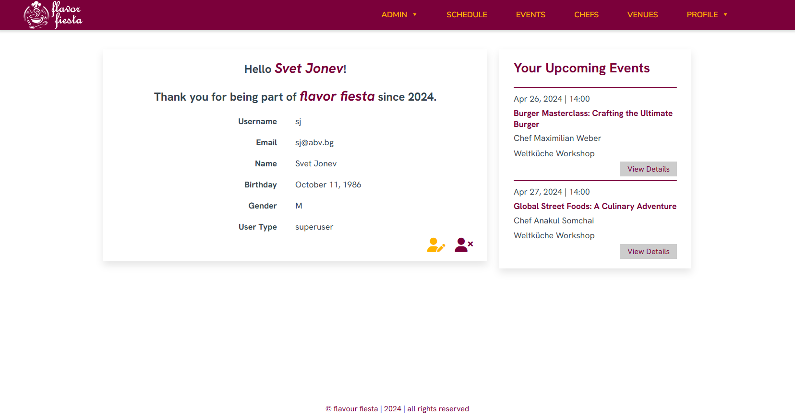

# flavor fiesta
- flavour fiesta is a Django-based platform designed to connect culinary enthusiasts with a variety of culinary events.

## Powered By
- Python
- Django/Django Rest Framework
- HTML+DTL/CSS/JavaScript
  
## Structure

1. Index (/)
   - Landing page with short description and sign in/ sign up functionality

   

3. Authorization (admin/) \
	Fully configured staff roles:
   - SiteAdmin - Complete control over the created content.
   - UserAdmin - CRUD operations for users.
   - ContentAdmin - CRUD operations for events, chefs and venues.
   - OccasionAdmin - CRUD operations for occasions, seats and tickets.
   - CommentAdmin - CRUD operations for comments.

	

4. Authentication and Profile Management (profiles/)
	- profiles/signin-user/ - Allows users to securely log in, accessing personalized features and settings.
	- profiles/signout-user/ - Ensures the end of the session, safeguarding user data by logging them out.
	- profiles/signup-user/ - Enables new users to register, inviting them to explore culinary experiences.
	- profiles/details/int:pk/ - Displays detailed profile information, including bookings.
	- profiles/edit/int:pk/ - Permits users to update their profile information, keeping it current.
	- profiles/delete/int:pk/ - Allows users to delete their accounts, removing all associated data for privacy.

	

	<strong>!Important:</strong> Administration links and icons are visible only by staff users and the access to specific pages is further limited, based on user authorization.

5. Events Section (events/)
	- events/ - Displays the dashboard with a collection of culinary events, inviting users to explore.
	- events/details/int:pk/slug:slug/ - Shows detailed information about an event, including image, description and booking options.
	- events/create/ - Enables authorized users to create new culinary events, expanding the platform's offerings.
	- events/edit/int:pk/slug:slug/ - Allows authorized users to update event details, ensuring information is current.
	- events/delete/int:pk/slug:slug/: Permits authorized users to delete events, removing them from the platform.
	- events/comment/int:pk/edit/: Enables authorized users to edit comments on events.
	- events/comment/int:pk/delete/: Allows authorized users to delete comments.

	

6. Chefs Section (chefs/)
	- chefs/ - Presents a dashboard showcasing featured chefs and their culinary expertise.
	- chefs/details/int:pk/slug:slug/ - Provides a detailed view of a chef's profile, including biography, specialties, and upcoming events.
	- chefs/create/ - Allows the creation of new chef profiles.
	- chefs/edit/int:pk/slug:slug/ - Enables updates to chef profiles, ensuring the accuracy of their information.
	- chefs/delete/int:pk/slug:slug/ - Allows authorized users to delete chef profiles.

	

7. Venues Section (venues/)
	- venues/ -  Displays a dashboard of venues, highlighting locations for culinary events and experiences.
	- venues/details/int:pk/slug:slug/ - Shows detailed venue information, including upcoming events at the venue.
	- venues/create/ - Permits the addition of new venues to the platform.
	- venues/edit/int:pk/slug:slug/ - Allows for the editing of venue details from authorized users.
	- venues/delete/int:pk/slug:slug/ - Enables the removal of venues from the platform from authorized users.

	

8. Occasions Section (occasions/)
    - occasions/dashboard/ - Displays a dashboard of occasions organized by month and year, offering users an overview of upcoming culinary activities.
	- occasions/create/ - Permits the addition of new occasions to the platform, facilitating the scheduling of culinary events.
	- occasions/edit/int:pk/ - Allows for the editing of occasion details by authorized users.
	- occasions/delete/int:pk/ - Enables the removal of occasions from the platform by authorized users.

	

9. Tickets Section (tickets/)
    - tickets/create/ - Enables authorized users to create new ticket types with various prices for a selected occasion.

10. Booking Management (bookings/)
	- bookings/book-occasion/int:occasion_id/ - Allows users to initiate a booking for a specific occasion, offering a choice of available tickets.
	- bookings/booking-details/int:pk/ - Displays detailed information about a user's booking, including event, chef, venue, date, seats and  total price, ensuring easy access to booking specifics.

	

11. API (api/)
	API integration designed for third-party sites, allowing only GET requests to retrieve information without modifying the database.
	- api/events/ - Retrieves a list of all culinary events. Supports filtering by event name (?name=) and event type (?event_type=), enabling users to find specific events of interest.
	- api/chefs/ - Provides a list of chefs featured on the platform. Supports search by chef name (?name=) and specialty (?specialty=), facilitating the discovery of chefs based on their culinary expertise.
	- api/venues/ - Fetches a list of venues where culinary events take place. Supports filtering by venue name (?name=) and location (?location=), helping users find venues in desired locations.
	- api/occasions/ - Retrieves a list of occasions, which are specific instances of culinary events. This endpoint offers a detailed view of occasions, including associated events, venues, and chefs.
   	